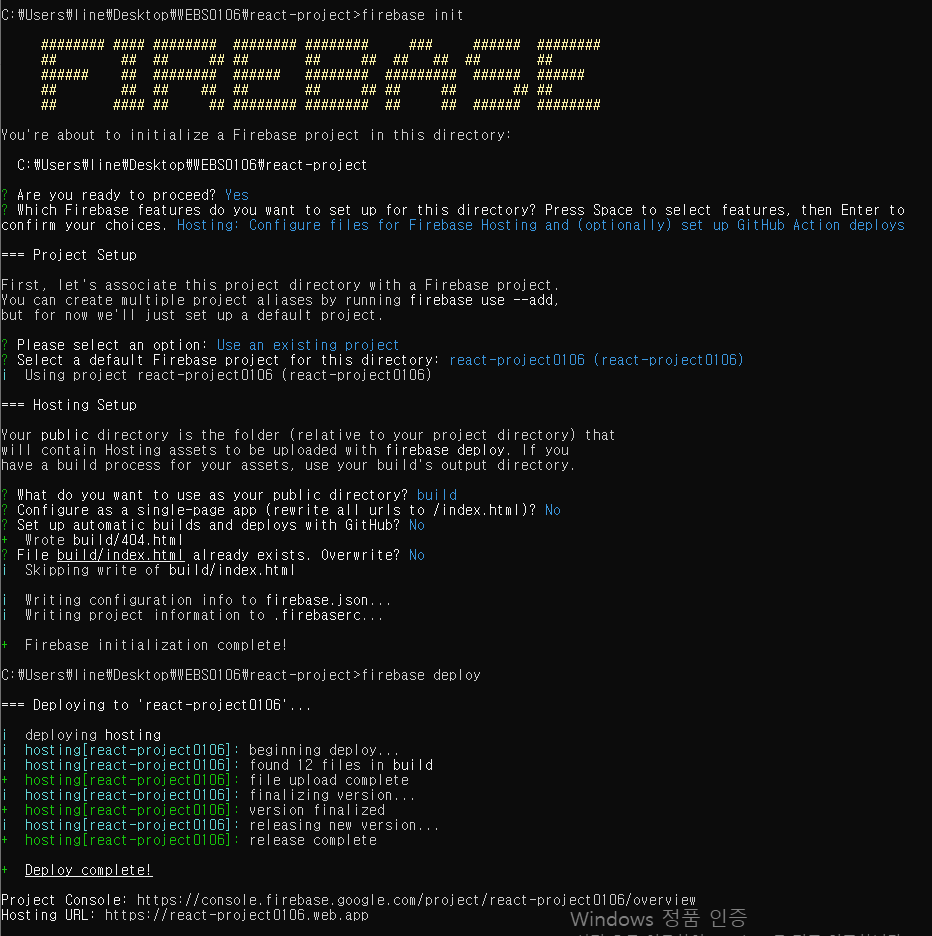

# react를 이용한 포트폴리오 사이트 만들기
리액트(React)는 페이스북에서 개발한 JavaScript 라이브러리로, 사용자 인터페이스(UI)를 만들기 위한 도구입니다.
리액트는 사용자 인터페이스를 구축하기 위한 강력하고 유연한 라이브러리로, 컴포넌트 기반 아키텍처와 성능 최적화를 강조하는 특징을 가지고 있습니다. 이를 통해 모던 웹 애플리케이션을 개발하는데 매우 유용한 도구입니다.

1. 컴포넌트 기반: 리액트 애플리케이션은 작은 독립적인 컴포넌트로 구성됩니다. 이 컴포넌트들은 재사용 가능하며, 복잡한 UI를 단순한 부분으로 나누어 작업할 수 있습니다.

2. 가상 DOM: 리액트는 가상 DOM(Virtual DOM)을 사용하여 성능을 최적화합니다. 실제 DOM 요소를 직접 조작하는 대신 가상 DOM을 업데이트하고 필요한 변경 사항만 실제 DOM에 반영합니다. 이로써 렌더링 성능이 향상됩니다.

3. 단방향 데이터 흐름: 리액트에서는 데이터가 부모 컴포넌트에서 자식 컴포넌트로 단방향으로 흐릅니다. 이로써 데이터 흐름이 예측 가능하고 디버깅이 용이해집니다.

4. 재사용 가능한 컴포넌트: 컴포넌트의 재사용성은 리액트의 핵심입니다. 한 번 작성한 컴포넌트를 다른 곳에서 쉽게 재사용할 수 있으며, 라이브러리와 패키지를 통해 다른 개발자들이 만든 컴포넌트도 활용할 수 있습니다.

5. 커뮤니티와 생태계: 리액트는 활발한 커뮤니티와 생태계를 가지고 있어 다양한 도구, 라이브러리, 및 리소스를 활용할 수 있습니다. 이는 리액트를 사용하여 빠르고 효율적으로 웹 애플리케이션을 개발할 수 있게 해줍니다.

6. JSX (JavaScript XML): JSX는 리액트에서 사용되는 문법으로, JavaScript 코드 안에 HTML과 유사한 구문을 사용할 수 있게 합니다. 이를 통해 컴포넌트의 UI를 선언적으로 작성할 수 있습니다.

7. 라우팅 및 상태 관리: 리액트 애플리케이션을 구축할 때, 라우팅 및 상태 관리를 위한 라이브러리와 도구를 통합하기 쉽습니다. 이로써 싱글 페이지 애플리케이션(SPA)을 쉽게 만들 수 있습니다.

## 미리보기
미리보기 : https://react-project0106.web.app

## 작업 순서
1. 리액트 설치
2. git에 업로드
3. [lenis 사이트](https://github.com/studio-freight/lenis)

## 설치
1. react 설치 `npx create-react-app 프로젝트 이름`
2. GSAP 설치 `npm i gsap`
3. sass 설치 `npm i sass`
4. lenis 설치 `npm i @studio-freight/lenis`
5. react-router-dom 설치 `npm i react-router-dom`

### GSAP
GSAP(GreenSock Animation Platform)은 웹 애니메이션을 구현하기 위한 강력한 자바스크립트 라이브러리입니다. GSAP은 웹 페이지에서 다양한 요소들을 부드럽게 움직이고 애니메이션 효과를 적용하는 데 사용됩니다.

GSAP은 다양한 애니메이션 기능을 제공하며, CSS, SVG, 캔버스 등 다양한 요소를 대상으로 애니메이션을 적용할 수 있습니다. 주요 기능으로는 요소의 이동, 회전, 크기 조절, 투명도 조절 등이 있습니다. 또한, 타임라인(Timeline)을 사용하여 여러 애니메이션을 조합하고 제어할 수도 있습니다.

GSAP은 사용하기 쉽고 직관적인 API를 제공하여 개발자가 원하는 애니메이션을 간편하게 구현할 수 있습니다. 또한, 애니메이션의 성능과 부드러움을 최적화하는 기능도 내장되어 있어 웹 페이지의 사용자 경험을 향상시킬 수 있습니다.

### lenis
lenis.js는 자바스크립트로 작성된 프로그램입니다. 이 프로그램은 음성 처리와 음성 인식에 사용되는 자음 소리의 성질을 분석하는 도구입니다.

lenis.js는 주어진 음성 데이터에서 자음 소리의 연음과 부드러움을 검출하는 기능을 제공합니다. 이를 통해 사용자는 음성 데이터에서 lenis(연음)과 fortis(비연음) 자음을 식별하고 분석할 수 있습니다.

이 프로그램은 음성 처리 및 음성 인식 애플리케이션 개발자들이 음성 데이터를 분석하고 자음의 특성을 이해하는 데 도움을 줍니다. 또한, 음성 인식 시스템의 정확성을 향상시키는 데에도 활용될 수 있습니다.

lenis.js는 자바스크립트로 작성되어 다양한 플랫폼에서 사용할 수 있으며, 음성 처리와 음성 인식 관련 프로젝트에 유용하게 활용될 수 있습니다.

## firebase 설치
1. 파이어베이스 프로젝트 생성
2. firebase web > 개발 > Hosting 시작하기
3. Hosting 설정하기
4. 폴더로 이동
5. firebase 설치 `npm install -g firebase-tools`
6. firebase 로그인 `firebase login`
7. 프로젝트 초기화 및 배포, 확인 
    

## 트러블 슈팅

Whitespace 에러

유닉스 시스템에서는 한 줄의 끝이 LF(Line Feed)로 이루어지는 반면, 윈도우에서는 줄 하나가 CR(Carriage Return)와 LF(Line Feed), 즉 CRLF로 이루어지는데 Git이 이 둘 중 어느 쪽을 선택할지 혼란으로 인하여 생기는 오류입니다. 
 
해결방안 
git config --global core.autocrlf true // 시스템 전체에 적용 
git config core.autocrlf true // 해당 프로젝트에만 적용

